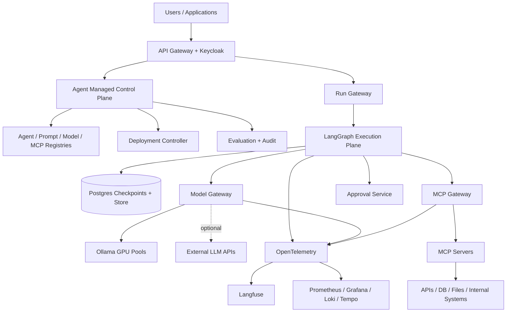

# AMP Open Source

Uma **Agent Managed Platform self-hosted** para criar, versionar, executar, governar e observar agentes de IA usando **LangGraph/LangChain** como runtime nativo e **Ollama** como provider principal de modelos.

> O projeto foi resetado arquiteturalmente em **2026-08-18**. O roadmap anterior foi descontinuado e a implementação será refeita do zero seguindo a nova arquitetura de microserviços.

## Arquitetura

A AMP separa explicitamente:

- **Control Plane** — Agent Registry, versões, prompts, modelos, MCPs, políticas, deploys e avaliações;
- **Agent Data Plane** — Run Gateway, scheduler, LangGraph runtimes, threads, checkpoints, streaming e Human-in-the-Loop;
- **Model Plane** — Model Gateway, Ollama Router, Ollama pools e LLM APIs opcionais;
- **Tool Plane** — MCP Registry, MCP Gateway e MCP servers;
- **State & Data Plane** — PostgreSQL, Redis/Valkey, MinIO, vector store e event bus;
- **Observability Plane** — OpenTelemetry, Langfuse, Prometheus/Grafana, Loki e Tempo.

## Princípios

- **Self-hosted por padrão**.
- **Ollama-first, provider-agnostic**.
- **LangGraph-native**: `StateGraph`, `create_agent`, subgraphs, checkpointers, Store, `interrupt()` e streaming.
- Agentes **não conhecem infraestrutura diretamente**.
- AgentVersion publicada é **imutável**.
- MCP é a fronteira padrão para capabilities/tools.
- Side effects usam idempotência e, quando necessário, Human-in-the-Loop.
- PostgreSQL é source of truth para estado crítico.
- Observabilidade e auditoria são responsabilidades distintas.
- Produção usa artifacts OCI por digest, GitOps e Kubernetes.

## Documentação principal

- [Arquitetura completa](docs/architecture/agent-managed-platform-self-hosted-langgraph-ollama.md)
- [Plano de implementação](docs/plano-amp-open-source.md)
- [Roadmap executável](docs/roadmap-agentic-workspace.md)
- [GitHub Issues](https://github.com/caleo-hub/amp-open-source/issues)
- [GitHub Project](https://github.com/users/caleo-hub/projects/6)

## Roadmap atual

| Fase | Resultado | Issue |
|---|---|---|
| 0 | Reset e monorepo | [#35](https://github.com/caleo-hub/amp-open-source/issues/35) |
| 1 | Infra, dados e contratos | [#36](https://github.com/caleo-hub/amp-open-source/issues/36) |
| 2 | Model Plane Ollama-first | [#37](https://github.com/caleo-hub/amp-open-source/issues/37) |
| 3 | Runtime LangGraph durável | [#38](https://github.com/caleo-hub/amp-open-source/issues/38) |
| 4 | Run Gateway e scheduler | [#39](https://github.com/caleo-hub/amp-open-source/issues/39) |
| 5 | Control Plane e registries | [#40](https://github.com/caleo-hub/amp-open-source/issues/40) |
| 6 | MCP Tool Plane | [#41](https://github.com/caleo-hub/amp-open-source/issues/41) |
| 7 | IAM, HITL, secrets e audit | [#42](https://github.com/caleo-hub/amp-open-source/issues/42) |
| 8 | Knowledge, RAG e memória | [#43](https://github.com/caleo-hub/amp-open-source/issues/43) |
| 9 | Web Console e SDKs | [#44](https://github.com/caleo-hub/amp-open-source/issues/44) |
| 10 | Observabilidade e evaluations | [#45](https://github.com/caleo-hub/amp-open-source/issues/45) |
| 11 | Kubernetes e enterprise ops | [#46](https://github.com/caleo-hub/amp-open-source/issues/46) |

## Stack de referência

**Core:** Python 3.12+, FastAPI, LangGraph, LangChain, Pydantic.  
**Models:** Ollama; LLM APIs externas opcionais via Model Gateway.  
**Tools:** MCP + `langchain-mcp-adapters`.  
**Data:** PostgreSQL, Redis/Valkey, MinIO, pgvector/Qdrant, NATS JetStream.  
**Security:** Keycloak, OpenBao/Vault-compatible, OPA opcional, NetworkPolicy.  
**Observability:** OpenTelemetry, Langfuse, Prometheus, Grafana, Loki, Tempo.  
**Deployment:** Kubernetes, Helm, Argo CD, Harbor.

## Status

O roadmap legado foi encerrado. Os issues antigos permanecem apenas como histórico do GitHub; o planejamento ativo começa na **issue #35**.

## Como participar

Antes de implementar mudanças grandes, consulte a arquitetura e abra uma issue vinculada a uma das fases do roadmap atual.

Consulte [CONTRIBUTING.md](CONTRIBUTING.md).

## Licença

Distribuído sob a licença MIT. Consulte [LICENSE](LICENSE).
