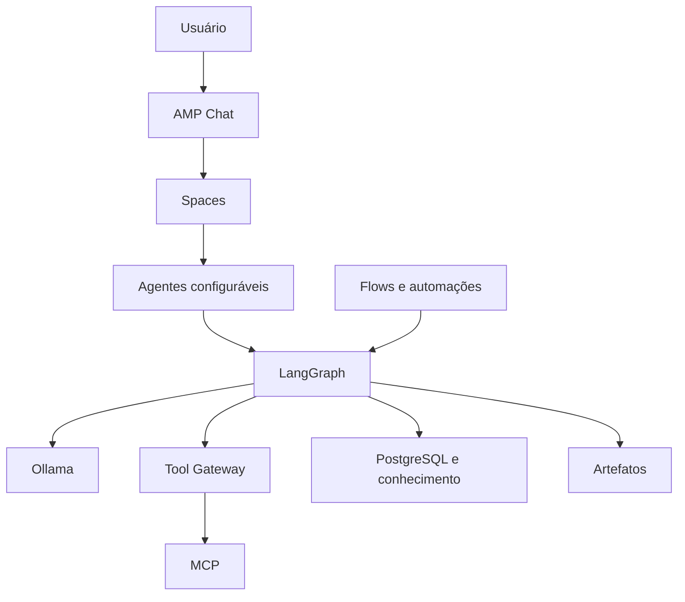

# AMP Open Source

Uma plataforma pessoal e self-hosted para construir, executar e administrar agentes de IA em um notebook Ubuntu.

## Visão

A AMP evolui de um agente local para um **workspace agêntico inspirado nos conceitos do Amazon Quick**: chat como interface principal, agentes configuráveis, Spaces, conhecimento, ferramentas MCP, aprovações, Research, artefatos e automações.

O projeto mantém:

- **Ollama** como servidor local de modelos e embeddings;
- **LangGraph** como runtime de agentes e workflows;
- **FastAPI** como API e plano de controle;
- **PostgreSQL** como fonte de verdade;
- **Docker Compose** como base operacional.

## Arquitetura

## Estado atual

- [x] Ubuntu, Docker e Ollama
- [x] LangGraph com modelo FAST
- [x] FastAPI e SearXNG
- [x] PostgreSQL, histórico e checkpoints persistentes
- [x] Worker, fila, retries, leases e idempotência
- [x] Canal inicial de voz, Alexa e AWS IoT
- [ ] Runtime observável e cancelável
- [ ] Chat web com streaming
- [ ] Agentes configuráveis e Spaces
- [ ] Tool Gateway e MCP
- [ ] Segurança e aprovações
- [ ] Conhecimento e memória
- [ ] Multiagentes, Research, artefatos e automações

## Roadmap

| Horizonte | Resultado |
|---|---|
| AMP Chat - MVP | Observabilidade, controle e chat web com streaming |
| AMP Workspace - V1 | Agentes, Spaces, MCP, segurança e conhecimento |
| AMP Agentic - V2 | Multiagentes, Research e artefatos |
| AMP Automate - V3 | Flows, agenda, gatilhos e operação confiável |

Consulte o [roadmap detalhado](docs/roadmap-agentic-workspace.md), as [Issues](https://github.com/caleo-hub/amp-open-source/issues), os [marcos](https://github.com/caleo-hub/amp-open-source/milestones) e o [quadro público](https://github.com/users/caleo-hub/projects/6/views/1).

O [plano humano original](docs/plano-amp-open-source.md) permanece como registro da fundação e do processo de aprendizagem.

## Princípios

- Um notebook antes de um cluster.
- Um agente controlável antes de multiagentes.
- UI e observabilidade antes de ampliar autonomia.
- MCP com política, aprovação e auditoria.
- Segurança antes de ações externas.
- Uma fase pequena e verificável por vez.

## Como participar

Sugestões e correções são bem-vindas. Antes de propor uma mudança grande, abra uma Issue descrevendo o problema que ela resolveria.

Consulte [CONTRIBUTING.md](CONTRIBUTING.md).

## Licença

Distribuído sob a licença MIT. Consulte [LICENSE](LICENSE).
