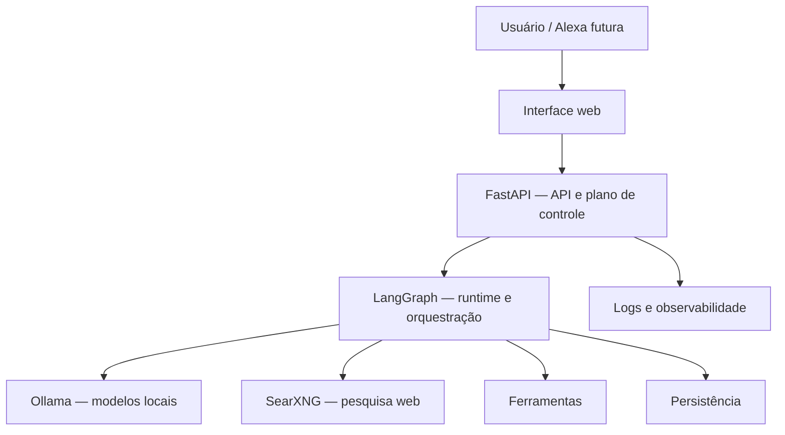

# AMP Open Source

Uma plataforma pessoal e self-hosted para aprender a construir, executar e administrar agentes de IA em um notebook com Ubuntu.

> Este projeto está em fase de planejamento e aprendizado. A proposta é evoluir em passos pequenos, mantendo cada etapa compreensível e utilizável.

## O que queremos construir

A AMP (*Agent Management Platform*) deverá, progressivamente:

- executar modelos locais com Ollama;
- orquestrar agentes e seus estados com LangGraph;
- expor as funções da plataforma por FastAPI;
- pesquisar na web por uma instância self-hosted do SearXNG;
- persistir conversas, execuções e checkpoints;
- oferecer observabilidade, permissões e aprovações humanas;
- coordenar fluxos multiagentes quando houver benefício real;
- disponibilizar uma interface web simples;
- preparar uma integração futura e segura com Alexa.

## O papel do LangGraph

**LangGraph é o runtime e orquestrador dos agentes — não é a plataforma inteira.**

A plataforma nasce da integração entre seus componentes:

## Filosofia

- Uma fase pequena por vez.
- Um notebook antes de um cluster.
- Docker Compose antes de Kubernetes.
- Um agente útil antes de multiagentes.
- SQLite antes de PostgreSQL, enquanto for suficiente.
- Logs claros antes de uma grande pilha de monitoramento.
- Segurança e confirmação humana antes de ações externas.

## Roadmap

| Etapa | Resultado |
|---|---|
| Fundação | Ubuntu, base do servidor, Docker e Ollama |
| Primeiro agente | LangGraph, FastAPI, SearXNG e pesquisa web |
| Plataforma mínima | Persistência, histórico e observabilidade |
| Evolução | Multiagentes, segurança, permissões e UI |
| Expansão | Operação doméstica confiável e Alexa |

As fases são acompanhadas pelas [Issues](https://github.com/caleo-hub/amp-open-source/issues), pelos [marcos](https://github.com/caleo-hub/amp-open-source/milestones) e pelo quadro público [AMP Open Source — Roadmap](https://github.com/users/caleo-hub/projects/6).

O roteiro detalhado, com tarefas, entregáveis, critérios de pronto e conteúdo de aprendizagem, está em [docs/plano-amp-open-source.md](docs/plano-amp-open-source.md).

## Estado atual

- [x] Visão e escopo inicial
- [x] Plano progressivo de implementação
- [ ] Preparação do notebook
- [ ] Primeira instalação do Ubuntu
- [ ] Primeiro serviço local

## Como participar

Este é inicialmente um projeto pessoal de hobby e aprendizado, mas sugestões e correções são bem-vindas. Antes de propor uma mudança grande, abra uma Issue descrevendo o problema que ela resolveria.

Consulte [CONTRIBUTING.md](CONTRIBUTING.md) para as regras simples de contribuição.

## Licença

Distribuído sob a licença MIT. Consulte [LICENSE](LICENSE).
