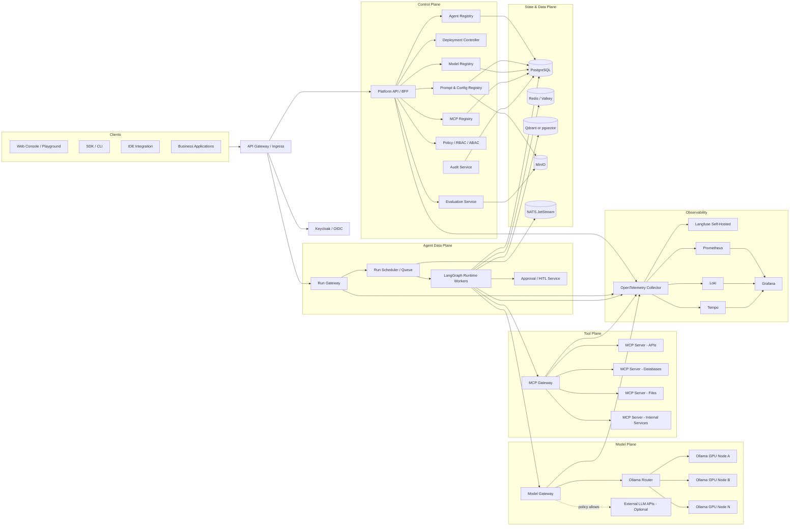
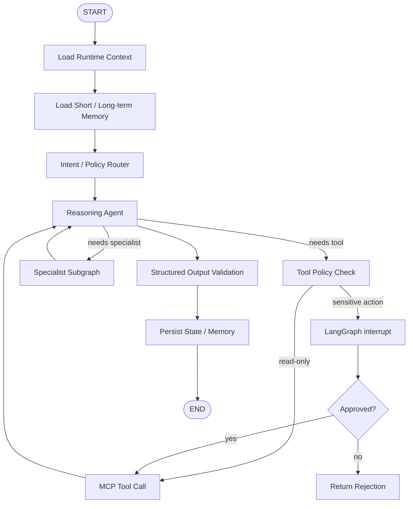
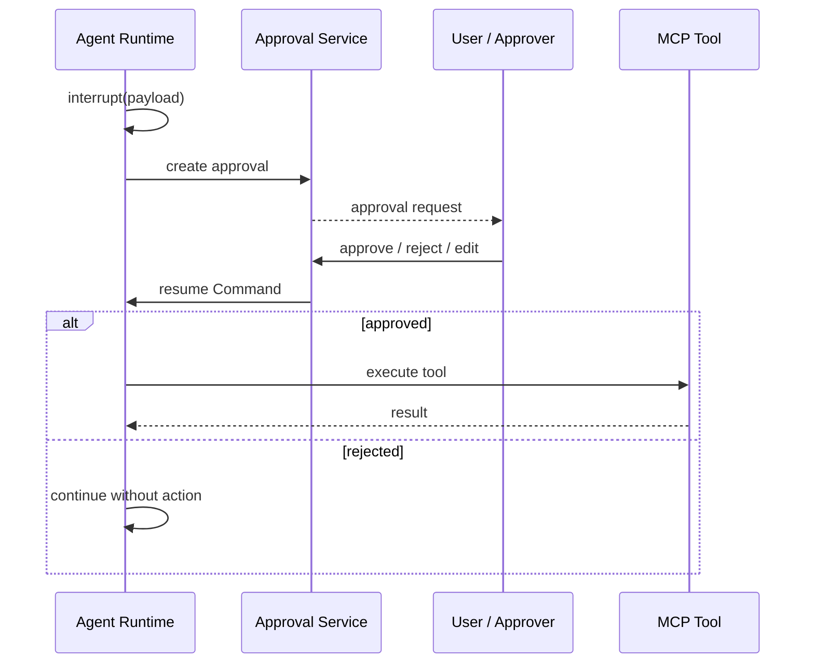
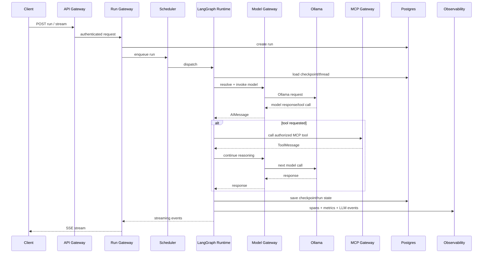
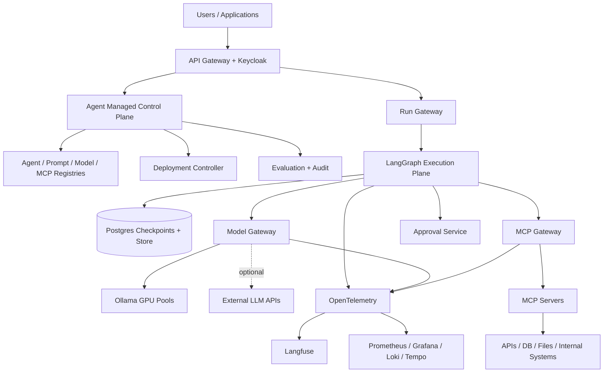

# Agent Managed Platform — Arquitetura Self-Hosted com LangGraph + Ollama

> **Status:** arquitetura de referência  
> **Objetivo:** transformar a arquitetura original em uma plataforma de agentes totalmente self-hosted, baseada em microserviços, com LangGraph/LangChain como runtime nativo de agentes, Ollama como provedor principal de modelos e suporte controlado a LLMs via API externa.  
> **Data-base da arquitetura:** 2026-08-18

---

## 1. Visão geral

A plataforma proposta separa claramente **Control Plane** e **Data Plane**.

- O **Control Plane** administra agentes, versões, deploys, modelos, políticas, MCP servers, prompts, permissões, avaliações e observabilidade.
- O **Data Plane** executa os agentes LangGraph, persiste threads/checkpoints, faz streaming, chama modelos e executa ferramentas via MCP.
- O **Model Plane** centraliza Ollama e os provedores externos de LLM.
- O **Tool Plane** centraliza MCP servers, autorização de tools e execução de integrações.
- O **State/Data Plane** fornece PostgreSQL, Redis/Valkey, vector store, object storage e event bus.
- O **Observability Plane** coleta traces, métricas, logs, tokens, tool calls, erros e avaliações.

O princípio central é:

> **O agente nunca conhece infraestrutura diretamente.** Ele conhece apenas abstrações LangGraph/LangChain: modelo, tools, state, store, checkpointer e runtime context.

Isso permite trocar Ollama, modelos externos, MCP servers, bancos, políticas e topologia de execução sem reescrever o grafo do agente.

---

## 2. Princípios arquiteturais

### 2.1 Self-hosted por padrão

Todo componente crítico roda na infraestrutura da organização:

- Kubernetes;
- API Gateway;
- autenticação e autorização;
- LangGraph runtimes;
- Ollama;
- PostgreSQL;
- Redis/Valkey;
- vector database;
- object storage;
- observabilidade;
- registry de agentes;
- registry de MCP;
- secrets;
- Git/CI/CD;
- container registry.

LLMs externos são uma **capacidade opcional**, governada por política, e não uma dependência da plataforma.

### 2.2 Ollama-first, provider-agnostic

A política padrão deve ser:

```text
Ollama local -> Ollama fallback local -> LLM API permitida -> erro controlado
```

O agente não instancia diretamente `ChatOllama`, `ChatOpenAI`, `ChatAnthropic`, etc. Ele recebe um modelo resolvido pelo **Model Gateway / Model Resolver**.

### 2.3 LangGraph-native

Os agentes devem usar preferencialmente:

- `StateGraph` para workflows explícitos;
- `create_agent` para agentes ReAct e subagentes simples;
- subgraphs para composição e especialização;
- checkpointers para estado por thread;
- Store para memória durável entre threads;
- `interrupt()` + `Command(resume=...)` para Human-in-the-Loop;
- `stream_events()` para streaming de mensagens, estado e eventos;
- structured output com Pydantic/JSON Schema;
- `langchain-mcp-adapters` para tools MCP;
- interfaces padronizadas de chat model do LangChain para trocar modelos sem acoplamento ao provider.

### 2.4 Imutabilidade de versão

Uma versão publicada de agente deve apontar para:

- commit Git;
- digest de container OCI;
- versão do manifest;
- versão de prompt;
- snapshot da política de modelo;
- snapshot das permissões MCP;
- versão dos schemas de input/output.

Nunca se altera uma versão publicada. Uma mudança gera uma nova versão.

### 2.5 Segurança por capability

O modelo não recebe acesso genérico à rede, banco ou filesystem.

Ele recebe somente tools explicitamente aprovadas para aquele agente, tenant e ambiente.

### 2.6 Tudo auditável

Cada operação importante precisa carregar:

- `tenant_id`;
- `user_id`;
- `agent_id`;
- `agent_version`;
- `deployment_id`;
- `thread_id`;
- `run_id`;
- `trace_id`;
- `model_profile`;
- `tool_name` quando aplicável.

---

## 3. Arquitetura de alto nível



---

## 4. Separação em Control Plane e Data Plane

### 4.1 Control Plane

O Control Plane administra o ciclo de vida dos agentes, mas **não executa raciocínio do agente**.

Responsabilidades:

- cadastro de agentes;
- versionamento;
- publicação;
- deploy;
- rollback;
- canary release;
- gerenciamento de prompts;
- gerenciamento de modelos;
- gerenciamento de MCP servers;
- permissões de tools;
- configurações por ambiente;
- quotas;
- secrets references;
- datasets de avaliação;
- auditoria;
- dashboards administrativos.

### 4.2 Data Plane

O Data Plane processa interações e runs.

Responsabilidades:

- threads;
- runs;
- streaming;
- execução LangGraph;
- checkpoints;
- memória;
- chamadas de modelos;
- chamadas MCP;
- Human-in-the-Loop;
- retry;
- timeout;
- cancelamento;
- event streaming;
- persistência de estado.

Essa separação permite atualizar a plataforma de administração sem interromper agentes em execução e escalar o runtime independentemente do painel.

---

## 5. Microserviços principais

### 5.1 `web-console`

Frontend React/Next.js self-hosted.

Funcionalidades:

- catálogo de agentes;
- criação e configuração;
- versões;
- deploys;
- playground;
- visualização do grafo;
- threads e runs;
- streaming em tempo real;
- gerenciamento de MCP;
- gerenciamento de modelos;
- prompts;
- secrets references;
- aprovações HITL;
- avaliações;
- traces;
- métricas;
- logs;
- auditoria.

O frontend não acessa diretamente runtimes, Ollama ou MCP servers. Tudo passa pelo API Gateway.

### 5.2 `platform-api`

Implementação recomendada: FastAPI.

É o BFF/API administrativa do Control Plane.

Responsabilidades:

- validar JWT OIDC;
- aplicar RBAC/ABAC;
- expor APIs administrativas;
- orquestrar chamadas aos registries;
- retornar uma visão consolidada para o frontend;
- nunca armazenar API keys em texto puro.

### 5.3 `agent-registry-service`

Fonte de verdade para metadados dos agentes.

Entidades principais:

- Agent;
- AgentVersion;
- AgentArtifact;
- AgentDeployment;
- Environment;
- AgentModelPolicy;
- AgentToolPolicy;
- AgentPromptBinding;
- AgentResourceProfile.

Uma `AgentVersion` deve ser imutável.

Exemplo conceitual:

```yaml
agent:
  id: finance-research-agent
  display_name: Finance Research Agent
  version: 1.4.2
  runtime: langgraph
  entrypoint: app.graph:graph
  artifact:
    git_commit: 88c1c2f
    image: registry.internal/agents/finance-research-agent@sha256:...

  input_schema: schemas/input.json
  output_schema: schemas/output.json

  model_policy: finance-default

  mcp_bindings:
    - market-data.read
    - internal-documents.search

  memory_policy:
    short_term: postgres
    long_term: postgres
    semantic_memory: true

  hitl_policy:
    require_approval_for:
      - external-email.send
      - database.write

  resources:
    cpu: "1"
    memory: 2Gi
    replicas_min: 2
    replicas_max: 10
```

### 5.4 `prompt-config-service`

Gerencia prompts e configurações sem acoplar tudo ao source code.

Armazena:

- system prompts;
- prompt templates;
- few-shot examples;
- output schemas;
- runtime config;
- feature flags;
- guardrail config.

Versões devem ser imutáveis após publicação.

O agente em produção recebe uma **versão resolvida** do prompt. Não deve carregar automaticamente o `latest`.

### 5.5 `deployment-controller`

Transforma uma versão de agente em workload Kubernetes.

Responsabilidades:

- criar/atualizar Deployments;
- configurar Services;
- configurar HPA/KEDA;
- injetar ConfigMaps;
- injetar Secrets por referência;
- criar NetworkPolicies;
- configurar ServiceAccounts;
- executar health checks;
- controlar canary;
- promover release;
- rollback por digest.

O controller não deve fazer `git clone` dentro do pod de runtime.

Fluxo correto:

```text
Git -> CI -> Test -> Build OCI -> Scan -> Registry -> Agent Registry -> Deployment Controller -> Kubernetes
```

### 5.6 `run-gateway`

É a entrada única do Data Plane.

Expõe APIs de execução sem revelar a topologia interna dos agentes.

Responsabilidades:

- criar threads;
- criar runs;
- SSE/WebSocket streaming;
- retomada de runs interrompidos;
- cancelamento;
- idempotência;
- autenticação;
- rate limit;
- resolução do deployment ativo;
- fan-out de eventos para o cliente.

O cliente não precisa saber se o agente está em um runtime próprio, pool compartilhado ou Agent Server.

### 5.7 `run-scheduler`

Responsável por execução durável e distribuição de runs.

Dados mínimos de cada run:

```text
run_id
tenant_id
user_id
agent_id
agent_version
deployment_id
thread_id
status
priority
input
created_at
started_at
finished_at
model_policy_snapshot
tool_policy_snapshot
trace_id
```

Estados recomendados:

```text
PENDING
QUEUED
RUNNING
INTERRUPTED
WAITING_APPROVAL
COMPLETED
FAILED
CANCELLED
TIMED_OUT
```

Para o runtime OSS próprio, o scheduler pode usar:

- PostgreSQL como durable source of truth;
- NATS JetStream para distribuição de jobs;
- Redis para locks, presença e streaming efêmero.

Os workers devem adquirir lease do run e renovar enquanto executam.

### 5.8 `agent-runtime`

É o microserviço que executa o grafo LangGraph.

Existem dois modos possíveis.

#### Modo A — OSS estrito

Implementar o runtime como serviço Python/FastAPI em cima de LangGraph OSS.

Usar diretamente:

- `StateGraph`;
- `create_agent`;
- `PostgresSaver` ou `AsyncPostgresSaver`;
- `PostgresStore` / Redis Store;
- `stream_events()`;
- `interrupt()`;
- `Command`;
- `langchain-mcp-adapters`;
- `ChatOllama` / model factory.

Esse modo não depende do LangSmith Control Plane.

A própria plataforma implementa:

- threads;
- runs;
- fila;
- streaming;
- scheduler;
- cancelamento;
- approvals;
- API pública.

#### Modo B — LangGraph Agent Server Standalone

Pode ser usado como backend de runtime quando o licenciamento da LangChain for aceitável.

Nesse modo, o `run-gateway` continua sendo o contrato público da plataforma, mas delega threads/runs para Agent Server.

Vantagem:

- API de assistants, threads e runs pronta;
- persistence e task queue integradas;
- streaming pronto;
- runtime mais alinhado ao produto oficial LangGraph.

Importante: o deployment standalone atual requer `LANGGRAPH_CLOUD_LICENSE_KEY` e infraestrutura PostgreSQL/Redis. Portanto ele deve ser uma **implementação substituível do Runtime Adapter**, e não uma dependência arquitetural obrigatória.

---

## 6. Arquitetura interna de um agente LangGraph



Um agente de produção deve preferir um state explícito.

Exemplo:

```python
from typing import Annotated, TypedDict
from langgraph.graph.message import add_messages


class AgentState(TypedDict):
    messages: Annotated[list, add_messages]
    tenant_id: str
    user_id: str
    thread_id: str
    intent: str | None
    active_agent: str | None
    retrieved_context: list[dict]
    pending_approval: dict | None
    result: dict | None
```

---

## 7. Subagentes e multi-agent

A plataforma não deve transformar tudo em multi-agent.

Usar multi-agent quando houver realmente:

- domínios especializados;
- tools distintas;
- políticas de segurança distintas;
- necessidade de contextos independentes;
- workflows complexos delegáveis.

Padrões suportados:

### 7.1 Supervisor + subgraphs

Um grafo superior escolhe qual subgraph executar.

### 7.2 Handoffs

O estado contém um `active_agent` e tools de transferência alteram a rota.

### 7.3 Agent-as-tool

Um agente especializado é exposto como tool para outro agente.

### 7.4 Workflow determinístico + nós agentic

Recomendado para processos empresariais.

Exemplo:

```text
validate_input
    -> fetch_context
    -> agent_reasoning
    -> policy_check
    -> execute_action
    -> validate_output
```

Esse padrão reduz comportamento emergente desnecessário.

---

## 8. Model Plane

### 8.1 `model-registry-service`

Mantém metadados de todos os modelos disponíveis.

Cada `ModelProfile` deve registrar:

- provider;
- model id;
- endpoint;
- secret reference;
- local/external;
- capability de tool calling;
- structured output;
- vision;
- embeddings;
- context window;
- reasoning capability;
- throughput estimado;
- timeout;
- concurrency limit;
- data classification permitida;
- tenants permitidos;
- ambientes permitidos;
- status de saúde.

Exemplo:

```yaml
id: ollama-reasoning-large
provider: ollama
model: ${OLLAMA_PRIMARY_MODEL}
endpoint_pool: ollama-prod
local: true
capabilities:
  chat: true
  tools: true
  structured_output: true
  vision: false
policies:
  max_concurrency: 8
  timeout_seconds: 180
  pii_allowed: true
```

O registry precisa validar capability porque nem todo modelo servido por Ollama oferece o mesmo nível de tool calling ou multimodalidade.

### 8.2 `model-gateway`

O Model Gateway é uma camada interna da plataforma e não deve conter lógica do agente.

Responsabilidades:

- resolver a política de modelo;
- construir a integração LangChain correta;
- balancear entre instâncias Ollama;
- aplicar timeout;
- retry;
- circuit breaker;
- quota;
- fallback;
- token accounting;
- redaction;
- logging/tracing;
- negar provider externo quando a política não permitir.

Interface conceitual:

```python
class ModelResolver:
    async def resolve(self, policy, runtime_context):
        ...
```

Uso dentro do agente:

```python
model = await model_resolver.resolve(
    policy=runtime.model_policy,
    runtime_context=runtime,
)
```

O grafo não deve fazer isto:

```python
# Evitar acoplamento direto em código de produção
model = ChatOpenAI(api_key="...")
```

### 8.3 Ollama como provider principal

Integração recomendada no runtime Python:

```python
from langchain_ollama import ChatOllama

model = ChatOllama(
    base_url="http://model-gateway.internal/ollama",
    model="${MODEL_NAME}",
    temperature=0,
)
```

Para embeddings:

```python
from langchain_ollama import OllamaEmbeddings

embeddings = OllamaEmbeddings(
    base_url="http://model-gateway.internal/ollama",
    model="embeddinggemma",
)
```

O Ollama deve rodar em nós Kubernetes com GPU, isolados por node pool.

### 8.4 Ollama Router

Ollama não deve ser exposto diretamente para todos os agentes.

Criar um `ollama-router` responsável por:

- descobrir instâncias saudáveis;
- identificar quais modelos estão presentes em cada nó;
- escolher replica;
- queue depth;
- health check;
- affinity por modelo;
- warm pools;
- concurrency control;
- métricas de GPU;
- controle de `keep_alive`;
- cache de model availability.

Fluxo:

```text
Agent -> Model Gateway -> Ollama Router -> Ollama Replica -> GPU
```

Uma abordagem prática é manter pools separados:

```text
ollama-general
ollama-reasoning
ollama-coding
ollama-vision
ollama-embedding
```

Assim cada pool possui HPA/política de hardware próprios.

### 8.5 LLM APIs externas

Suporte por adaptadores LangChain.

Exemplos possíveis:

- OpenAI;
- Azure OpenAI;
- Anthropic;
- Google Gemini;
- Bedrock;
- OpenRouter;
- providers OpenAI-compatible.

A configuração é feita no Model Registry, não no código do agente.

Exemplo de política:

```yaml
id: confidential-default
routing:
  primary:
    provider: ollama
    profile: ollama-reasoning-large

  fallbacks:
    - provider: ollama
      profile: ollama-general

    - provider: openai
      profile: external-premium
      when:
        environment: prod
        data_classification: public_or_internal
        tenant_opt_in: true
```

Para dados classificados como `restricted`, a política pode definir:

```yaml
external_providers: deny
```

### 8.6 LiteLLM

LiteLLM não é necessário para o núcleo da plataforma.

A recomendação é utilizar as interfaces nativas LangChain para models e manter o Model Gateway como abstração própria.

LiteLLM pode ser adicionado opcionalmente caso exista necessidade específica de:

- compatibilidade OpenAI para sistemas legados;
- roteamento de dezenas de providers;
- accounting centralizado já existente em LiteLLM.

Mesmo nesse cenário, o código dos agentes continua dependendo de LangChain/LangGraph, não de LiteLLM.

---

## 9. MCP / Tool Plane

### 9.1 `mcp-registry-service`

Substitui o MCP Registry API da arquitetura original.

Armazena:

- MCP server;
- versão;
- endpoint;
- transport;
- health;
- capabilities;
- tools;
- resources;
- prompts;
- auth profile;
- scopes;
- tenant bindings;
- timeout;
- rate limits;
- side-effect classification.

Exemplo:

```yaml
server:
  id: corporate-db
  transport: streamable_http
  url: http://mcp-corporate-db.amp-tools.svc/mcp
  auth_profile: service-identity

  tools:
    - name: employee.search
      risk: read
    - name: employee.update
      risk: write
      requires_approval: true
```

### 9.2 `mcp-gateway`

Os agentes não devem acessar cada MCP server diretamente em produção.

O MCP Gateway funciona como uma camada de federação e policy enforcement.

Responsabilidades:

- resolver MCP servers registrados;
- carregar tools autorizadas;
- propagar identidade do usuário;
- aplicar scopes;
- aplicar timeout;
- limitar payload;
- validar schemas;
- registrar auditoria;
- classificar read/write;
- bloquear tools não autorizadas;
- injetar credenciais somente no momento da execução;
- redigir secrets antes de enviar eventos para observabilidade.

O runtime LangGraph pode usar `MultiServerMCPClient` do `langchain-mcp-adapters` para comunicar-se com o gateway ou diretamente com MCP servers em ambientes de desenvolvimento.

### 9.3 MCP servers

Cada integração relevante deve ser encapsulada como MCP server.

Exemplos:

```text
mcp-http-api
mcp-postgresql-readonly
mcp-files
mcp-minio
mcp-git
mcp-ticketing
mcp-crm
mcp-email
mcp-search
mcp-cloud-ops
```

Cada servidor deve possuir:

- container próprio;
- ServiceAccount própria;
- NetworkPolicy própria;
- secrets mínimos;
- logs próprios;
- timeout;
- resource limits;
- schema de tools;
- versionamento.

Tools de risco elevado devem executar em pods/Jobs sandboxed quando possível.

---

## 10. Human-in-the-Loop

LangGraph `interrupt()` deve ser o mecanismo padrão para pausar runs que necessitem intervenção humana.

Exemplos:

- enviar e-mail;
- excluir dados;
- executar alteração em banco;
- publicar conteúdo;
- chamar API financeira;
- conceder acesso;
- executar automação de infraestrutura.

Fluxo:



O payload de approval deve conter uma versão segura e explícita da ação:

```json
{
  "action": "database.update",
  "resource": "customer/123",
  "summary": "Atualizar status para inactive",
  "arguments": {
    "customer_id": "123",
    "new_status": "inactive"
  }
}
```

Nunca enviar secrets no approval payload.

---

## 11. Persistence e memória

LangGraph diferencia corretamente dois conceitos que devem aparecer também na plataforma.

### 11.1 Short-term / thread-scoped state

Usar Checkpointer.

Produção recomendada:

```text
AsyncPostgresSaver / PostgresSaver -> PostgreSQL
```

Usos:

- mensagens;
- estado do grafo;
- retomada após erro;
- interrupt;
- time travel/debug;
- continuidade de conversa.

### 11.2 Long-term memory

Usar LangGraph Store.

Produção recomendada:

```text
PostgresStore ou RedisStore
```

Usos:

- preferências do usuário;
- facts persistentes;
- contexto entre threads;
- memória organizacional controlada.

Namespaces recomendados:

```text
(tenant_id, user_id, "memories")
(tenant_id, agent_id, "knowledge")
(tenant_id, team_id, "shared")
```

### 11.3 RAG documental

Separar memória de agente de base documental.

Pipeline:

```text
Source -> Ingestion Service -> Parse -> Chunk -> Ollama Embeddings -> Vector DB
                                                     |
                                                     -> Metadata PostgreSQL
                                                     -> Raw objects MinIO
```

Vector store padrão sugerido:

- Qdrant para uma camada vetorial dedicada;
- `pgvector` quando a prioridade for reduzir quantidade de componentes.

Ollama deve fornecer embeddings por padrão.

---

## 12. `knowledge-service`

Microserviço responsável por ingestão e retrieval de documentos.

Responsabilidades:

- upload;
- connectors;
- parsing;
- chunking;
- metadata extraction;
- embeddings;
- indexing;
- ACL de documentos;
- deletion;
- reindex;
- retrieval híbrido;
- citations metadata.

O agente não consulta Qdrant diretamente. Ele usa uma tool LangChain ou MCP, por exemplo:

```text
knowledge.search
knowledge.fetch_document
```

Isso mantém ACL, auditoria e filtros fora do prompt.

---

## 13. Event-driven architecture

NATS JetStream é o event bus recomendado para eventos de domínio da plataforma.

Exemplos:

```text
agent.created
agent.version.published
deployment.requested
deployment.ready
deployment.failed
run.created
run.started
run.interrupted
run.completed
run.failed
approval.requested
approval.resolved
model.health.changed
mcp.health.changed
evaluation.completed
```

Nunca usar eventos como única fonte de verdade de entidades críticas. PostgreSQL continua sendo o source of truth do Control Plane.

---

## 14. Fluxo completo de uma requisição



---

## 15. API pública da plataforma

### 15.1 Control Plane APIs

Exemplos:

```text
POST   /api/v1/agents
GET    /api/v1/agents
GET    /api/v1/agents/{agent_id}
POST   /api/v1/agents/{agent_id}/versions
POST   /api/v1/agents/{agent_id}/versions/{version}/publish

POST   /api/v1/deployments
GET    /api/v1/deployments/{deployment_id}
POST   /api/v1/deployments/{deployment_id}/promote
POST   /api/v1/deployments/{deployment_id}/rollback

GET    /api/v1/models
POST   /api/v1/models
POST   /api/v1/model-policies

GET    /api/v1/mcp/servers
POST   /api/v1/mcp/servers
POST   /api/v1/mcp/bindings

POST   /api/v1/evaluation-suites
POST   /api/v1/evaluation-runs
```

### 15.2 Runtime APIs

```text
POST   /api/v1/threads
GET    /api/v1/threads/{thread_id}

POST   /api/v1/runs
GET    /api/v1/runs/{run_id}
POST   /api/v1/runs/{run_id}/cancel
POST   /api/v1/runs/{run_id}/resume
GET    /api/v1/runs/{run_id}/stream

POST   /api/v1/threads/{thread_id}/runs/stream
```

Headers recomendados:

```text
Authorization: Bearer <OIDC JWT>
X-Tenant-ID: <tenant>
X-Idempotency-Key: <uuid>
X-Correlation-ID: <uuid>
```

---

## 16. Streaming protocol

SSE é a opção padrão para chat/runs interativos.

Tipos de eventos:

```text
run.created
run.started
message.delta
message.completed
state.update
tool.requested
tool.result
interrupt.created
approval.required
run.completed
run.failed
heartbeat
```

Exemplo:

```text
event: message.delta
data: {"run_id":"...","content":"Olá"}

event: tool.requested
data: {"tool":"knowledge.search","args":{"query":"..."}}

event: run.completed
data: {"run_id":"...","status":"completed"}
```

O cliente deve conseguir reconectar informando o último event id.

---

## 17. AuthN / AuthZ

### 17.1 Identity Provider

Usar Keycloak self-hosted via OIDC/OAuth2.

Roles sugeridas:

```text
platform-admin
platform-operator
agent-owner
agent-developer
mcp-admin
model-admin
auditor
approver
end-user
```

### 17.2 Autorização

Combinar:

- RBAC para papéis amplos;
- ABAC para tenant, ambiente, classificação de dados, agente e tool;
- policy engine opcional com OPA.

Exemplo:

```text
user may run agent X
AND agent X may use MCP server Y
AND tool Y.write requires approver role
AND external LLM is denied for restricted data
```

---

## 18. Secrets

Secrets não ficam em:

- manifests dos agentes;
- PostgreSQL em texto puro;
- prompts;
- Git;
- observability payloads.

Usar:

```text
OpenBao / Vault-compatible secret store
```

O registry guarda somente referências:

```yaml
secret_ref: openbao://providers/openai/prod
```

A credencial é resolvida pelo serviço que precisa utilizá-la e somente no momento da chamada.

---

## 19. Network security

Política padrão: **deny-by-default**.

### Agent Runtime

Pode acessar somente:

```text
Model Gateway
MCP Gateway
PostgreSQL / Store
Redis
OpenTelemetry Collector
```

Não pode sair livremente para internet.

### Model Gateway

Pode acessar:

```text
Ollama pools
external LLM APIs permitidas
secret store
observability
```

### MCP Gateway

Pode acessar MCP servers registrados.

### MCP Server

Possui egress específico somente para o sistema integrado.

Essa estrutura reduz drasticamente o impacto de prompt injection que tente induzir o modelo a acessar serviços fora de sua capability list.

---

## 20. Observabilidade

A arquitetura original possuía LiteLLM + Langfuse. A nova arquitetura separa model routing de observabilidade.

### 20.1 OpenTelemetry como backbone

Todo microserviço emite OTLP para OpenTelemetry Collector.

Atributos recomendados:

```text
service.name
service.version
tenant.id
agent.id
agent.version
deployment.id
thread.id
run.id
model.provider
model.name
mcp.server
mcp.tool
```

Nunca adicionar prompt inteiro como atributo de span.

### 20.2 Langfuse self-hosted

Usar para observabilidade LLM/agentic:

- prompt/completion traces;
- tool calls;
- latency;
- token usage;
- scores;
- evaluation metadata;
- datasets.

Deve ser tratado como componente de observabilidade, não como runtime obrigatório.

### 20.3 Prometheus + Grafana

Métricas operacionais:

```text
runs_total
runs_failed_total
runs_active
queue_depth
run_duration_seconds
model_requests_total
model_latency_seconds
tokens_input_total
tokens_output_total
mcp_calls_total
mcp_errors_total
interrupts_total
approval_wait_seconds
ollama_gpu_utilization
ollama_queue_depth
```

### 20.4 Loki + Tempo

- Loki: logs;
- Tempo: distributed tracing;
- Grafana: correlação logs -> traces -> metrics.

---

## 21. Auditoria

Auditoria precisa ser separada de logging operacional.

Eventos auditáveis:

- login;
- criação de agente;
- publicação de versão;
- alteração de política;
- criação de model profile;
- alteração de secret reference;
- binding de MCP;
- execução de tool de escrita;
- approval/reject;
- deploy;
- rollback;
- acesso administrativo a threads/runs.

Registro recomendado:

```json
{
  "event": "mcp.tool.executed",
  "tenant_id": "acme",
  "user_id": "u-123",
  "agent_id": "support-agent",
  "run_id": "r-456",
  "tool": "crm.customer.update",
  "approval_id": "a-789",
  "result": "success",
  "timestamp": "..."
}
```

---

## 22. Agent build e CI/CD

```mermaid
flowchart LR
    DEV[Developer] --> GIT[Forgejo / Gitea / GitLab]
    GIT --> CI[CI Runner]
    CI --> TEST[Unit + Integration Tests]
    TEST --> EVAL[Agent Evaluation Suite]
    EVAL --> SCAN[Security / SBOM Scan]
    SCAN --> BUILD[Build OCI Image]
    BUILD --> REG[Harbor Registry]
    REG --> AR[Agent Registry]
    AR --> DEP[Deployment Controller]
    DEP --> K8S[Kubernetes]
```



Pipeline mínimo:

```text
1. lint
2. unit tests
3. graph compile test
4. MCP contract tests
5. model capability tests
6. structured output tests
7. security scan
8. evaluation suite
9. build image
10. generate SBOM
11. push Harbor
12. publish AgentVersion
13. deploy staging
14. smoke test
15. promote/canary production
```

---

## 23. Estrutura recomendada de repositório

```text
agent-managed-platform/
├── apps/
│   └── web-console/
│
├── services/
│   ├── platform-api/
│   ├── agent-registry/
│   ├── prompt-config-service/
│   ├── deployment-controller/
│   ├── run-gateway/
│   ├── run-scheduler/
│   ├── model-registry/
│   ├── model-gateway/
│   ├── ollama-router/
│   ├── mcp-registry/
│   ├── mcp-gateway/
│   ├── knowledge-service/
│   ├── approval-service/
│   ├── evaluation-service/
│   └── audit-service/
│
├── agents/
│   ├── support-agent/
│   │   ├── app/
│   │   │   ├── graph.py
│   │   │   ├── state.py
│   │   │   ├── nodes/
│   │   │   ├── subgraphs/
│   │   │   ├── schemas/
│   │   │   └── prompts/
│   │   ├── tests/
│   │   ├── evals/
│   │   ├── agent.yaml
│   │   ├── langgraph.json
│   │   ├── pyproject.toml
│   │   └── Dockerfile
│   └── ...
│
├── mcp-servers/
│   ├── mcp-database/
│   ├── mcp-files/
│   ├── mcp-internal-api/
│   └── ...
│
├── packages/
│   ├── amp-agent-sdk/
│   ├── amp-model-runtime/
│   ├── amp-mcp-sdk/
│   ├── amp-observability/
│   ├── amp-security/
│   └── amp-contracts/
│
├── deploy/
│   ├── helm/
│   ├── argocd/
│   ├── keycloak/
│   ├── observability/
│   └── policies/
│
└── docs/
    └── architecture/
```

---

## 24. SDK interno para agentes

Criar um pacote `amp-agent-sdk` para esconder detalhes da plataforma.

Exemplo:

```python
from amp_agent_sdk import ManagedAgentRuntime

runtime = ManagedAgentRuntime.from_context()

model = await runtime.models.get("default")
tools = await runtime.tools.get_authorized_tools()
memory = runtime.memory
identity = runtime.identity
```

Benefícios:

- zero hardcode de URLs;
- zero hardcode de secrets;
- troca de model gateway transparente;
- tracing automático;
- tags padronizadas;
- policy enforcement centralizado;
- testes mais simples.

---

## 25. Exemplo de graph factory

```python
from langchain.agents import create_agent
from langgraph.checkpoint.postgres.aio import AsyncPostgresSaver
from langgraph.store.postgres import PostgresStore

from amp_agent_sdk import ManagedAgentRuntime


async def build_graph():
    runtime = ManagedAgentRuntime.from_context()

    model = await runtime.models.get("default")
    tools = await runtime.tools.get_authorized_tools()

    agent = create_agent(
        model=model,
        tools=tools,
        system_prompt=await runtime.prompts.get("system"),
    )

    return agent
```

Para agentes mais complexos, usar `StateGraph` explicitamente e manter `create_agent` em nós/subgraphs especializados.

---

## 26. Structured output

Toda integração máquina-a-máquina deve usar output estruturado.

Exemplo:

```python
from pydantic import BaseModel


class AgentResult(BaseModel):
    answer: str
    confidence: float
    citations: list[str]
    requires_human_review: bool
```

A plataforma deve validar a resposta antes de enviar ao consumidor.

Quando o modelo local não suportar determinada capability necessária, o Model Resolver deve:

1. selecionar outro modelo local compatível;
2. utilizar fallback externo somente se permitido;
3. falhar de forma explícita se nenhuma alternativa estiver autorizada.

---

## 27. Retry, fallback e circuit breaker

Nunca colocar retry genérico ao redor do grafo inteiro.

Aplicar retry na fronteira correta.

### Model call

```text
retry local instance
-> another Ollama replica
-> another local model
-> external provider if policy allows
```

### MCP call

```text
timeout
-> retry only if tool is idempotent
-> circuit breaker
-> structured ToolMessage error
```

### Side effects

Não repetir automaticamente ações como:

```text
send_email
create_ticket
charge_payment
delete_record
update_database
```

Essas tools precisam de idempotency key e semântica explícita.

---

## 28. Multi-tenancy

Toda entidade deve possuir `tenant_id`.

Camadas de isolamento:

- JWT tenant claim;
- row-level security ou filtro obrigatório no PostgreSQL;
- namespaces de memória;
- quotas por tenant;
- model policy por tenant;
- MCP bindings por tenant;
- secrets por tenant;
- observability tags por tenant;
- MinIO buckets/prefixes por tenant;
- vector collections/namespaces por tenant.

Para tenants altamente sensíveis, permitir runtime e model pool dedicados.

---

## 29. Kubernetes topology

Namespaces sugeridos:

```text
amp-system
amp-control
amp-runtime
amp-models
amp-tools
amp-data
amp-observability
amp-security
```

Node pools:

```text
general-cpu
runtime-cpu
model-gpu
observability-cpu-memory
stateful-storage
```

### `amp-models`

Executa:

- Ollama pods;
- model router;
- GPU exporter;
- model preload Jobs.

### `amp-runtime`

Executa:

- run-gateway;
- scheduler workers;
- agent runtime deployments.

### `amp-tools`

Executa:

- MCP gateway;
- MCP servers;
- sandbox Jobs.

---

## 30. Autoscaling

### Agent Runtime

Escalar por:

- active runs;
- queue depth;
- CPU;
- memory;
- p95 run latency.

### Ollama

Escalar por:

- queue depth por model pool;
- active requests;
- GPU utilization;
- tokens/s;
- p95 first-token latency.

O scale-up precisa considerar tempo de carregamento do modelo.

Manter pelo menos uma réplica quente dos modelos críticos.

Se for utilizado o Agent Server Standalone oficial, evitar scale-to-zero dos workers, pois o runtime oficial pressupõe workers disponíveis para consumir a fila.

---

## 31. Alta disponibilidade

Produção recomendada:

- 2+ réplicas do API Gateway;
- 2+ réplicas dos serviços stateless;
- PostgreSQL HA;
- Redis/Valkey HA;
- NATS cluster;
- MinIO distribuído;
- múltiplas réplicas do model gateway;
- múltiplos Ollama workers para modelos críticos;
- PodDisruptionBudgets;
- anti-affinity;
- backups testados;
- restore drills.

---

## 32. Banco de dados lógico

Entidades do Control Plane:

```text
Tenant
UserBinding
Agent
AgentVersion
AgentArtifact
Deployment
Environment
Prompt
PromptVersion
ModelProfile
ModelPolicy
MCPServer
MCPServerVersion
MCPTool
MCPBinding
ToolPolicy
SecretReference
EvaluationSuite
EvaluationRun
Approval
AuditEvent
```

Entidades do Data Plane:

```text
Thread
Run
RunEvent
RunLease
Checkpoint
MemoryNamespace
```

Quando Agent Server Standalone estiver ativo, parte dessas entidades de execução pode ser mantida pelo próprio Agent Server e apenas referenciada pela plataforma.

---

## 33. Modelo de deployment de agente

```yaml
apiVersion: amp.internal/v1alpha1
kind: AgentDeployment
metadata:
  name: support-agent-prod
spec:
  agentRef:
    id: support-agent
    version: 2.3.1

  environment: prod

  image:
    digest: sha256:...

  scaling:
    minReplicas: 2
    maxReplicas: 20
    targetConcurrentRuns: 8

  modelPolicyRef: support-prod

  toolPolicyRef: support-prod

  runtime:
    mode: oss-langgraph

  resources:
    requests:
      cpu: "500m"
      memory: "1Gi"
    limits:
      cpu: "2"
      memory: "4Gi"
```

---

## 34. Evaluation Service

Antes de promover uma versão, executar uma suíte de avaliação.

Tipos:

- deterministic assertions;
- schema validation;
- tool selection accuracy;
- forbidden-tool checks;
- hallucination checks;
- RAG groundedness;
- latency;
- token usage;
- local model vs fallback model comparison;
- regression tests;
- LLM-as-judge opcional.

Datasets ficam em PostgreSQL/MinIO.

Um deploy pode possuir gates como:

```yaml
promotion_gates:
  min_success_rate: 0.97
  max_p95_latency_ms: 12000
  forbidden_tool_violations: 0
  structured_output_success_rate: 0.995
```

---

## 35. Air-gapped mode

A plataforma pode operar sem acesso à internet.

Requisitos:

- mirror de imagens OCI em Harbor;
- mirror de pacotes Python/Node;
- modelos Ollama pré-carregados;
- Git self-hosted;
- DNS interno;
- CA interna;
- external LLM policy = deny;
- LangSmith desabilitado;
- Langfuse local;
- observabilidade local;
- secrets locais.

Um bundle de release deve incluir:

```text
containers
helm charts
python wheels
node packages
ollama model artifacts
SBOM
checksums
migration scripts
```

---

## 36. Stack de referência

### Core de aplicação

```text
Python 3.12+
FastAPI
LangGraph
LangChain
langchain-ollama
langchain-mcp-adapters
Pydantic
```

### Frontend

```text
React / Next.js
ReactFlow para graph visualization
SSE client
OIDC client
```

### Infraestrutura

```text
Kubernetes
Helm
Argo CD
Harbor
Forgejo/Gitea/GitLab self-hosted
```

### Segurança

```text
Keycloak
OpenBao
OPA optional
NetworkPolicy
mTLS / service mesh optional
```

### Dados

```text
PostgreSQL
Redis / Valkey
NATS JetStream
Qdrant or pgvector
MinIO
```

### Modelos

```text
Ollama primary
LangChain provider integrations for optional API LLMs
```

### Observabilidade

```text
OpenTelemetry Collector
Langfuse self-hosted
Prometheus
Grafana
Loki
Tempo
```

---

## 37. Versão mínima de produção

Para não iniciar com componentes demais, uma primeira versão produtiva pode usar:

```text
Kubernetes
Traefik / NGINX Ingress
Keycloak
Platform API
Agent Registry
Run Gateway + Scheduler
LangGraph Runtime
Model Gateway
Ollama
MCP Registry + Gateway
PostgreSQL
Redis
MinIO
Qdrant ou pgvector
OpenTelemetry
Prometheus + Grafana
Langfuse
```

NATS, OpenBao, Harbor, Argo CD, Loki e Tempo podem ser adicionados à medida que a plataforma amadurece, embora sejam recomendados para uma instalação enterprise completa.

---

## 38. Roadmap sugerido

### Fase 1 — Core Runtime

- LangGraph runtime;
- Ollama;
- Model Gateway;
- Postgres checkpointer/store;
- Run Gateway;
- streaming;
- Agent Registry;
- MCP Registry;
- MCP Gateway;
- Keycloak;
- UI básica.

### Fase 2 — Managed Platform

- Deployment Controller;
- CI/CD;
- Harbor;
- versionamento imutável;
- prompts;
- approvals;
- audit;
- evaluation service;
- multi-tenancy.

### Fase 3 — Enterprise Operations

- HA;
- autoscaling;
- canary;
- quotas;
- OpenBao;
- OPA;
- NATS;
- full observability;
- GPU pool management;
- disaster recovery;
- air-gapped release bundle.

---

## 39. Decisões principais em relação à arquitetura original

### Antes: FastAPI Agent Registry API

Agora:

```text
Platform API
+ Agent Registry Service
+ Deployment Controller
+ immutable OCI artifacts
```

### Antes: UI/Windsurf interagindo diretamente com agents

Agora:

```text
Web Console / IDE
-> API Gateway
-> Run Gateway
-> Runtime
```

### Antes: agentes como bloco genérico

Agora:

```text
LangGraph Runtime
-> StateGraph
-> subgraphs
-> checkpoint/store
-> streaming
-> interrupts
```

### Antes: LiteLLM como camada central

Agora:

```text
LangChain Model Interface
-> Model Gateway
-> Ollama first
-> optional external providers
```

LiteLLM vira opcional.

### Antes: Langfuse + logging em bloco único

Agora:

```text
OpenTelemetry backbone
-> Langfuse for LLM traces
-> Prometheus/Grafana for metrics
-> Loki for logs
-> Tempo for distributed traces
```

### Antes: FastAPI MCP Registry API

Agora:

```text
MCP Registry
+ MCP Gateway
+ versioned MCP server deployments
+ tool-level policy
```

### Antes: MCP servers acessando sistemas diretamente

Permanece conceitualmente, mas agora possuem:

```text
identity
policy
network isolation
audit
approval
rate limit
timeout
versioning
```

---

## 40. Arquitetura final resumida



O resultado é uma **Agent Managed Platform** em que:

- agentes são artefatos versionados;
- LangGraph é o engine de execução;
- Ollama é o provider principal;
- LLMs externos são fallbacks governados;
- MCP é a única fronteira de tools recomendada;
- checkpoints e memória são persistentes;
- ações sensíveis usam Human-in-the-Loop;
- execução é separada do Control Plane;
- cada chamada é observável e auditável;
- o sistema pode operar totalmente on-premises e até air-gapped.

---

## 41. Referências técnicas oficiais

As decisões relacionadas a LangGraph, LangChain e Ollama foram baseadas nas documentações oficiais abaixo.

- LangGraph — Persistence: https://docs.langchain.com/oss/python/langgraph/persistence
- LangGraph — Memory: https://docs.langchain.com/oss/python/langgraph/add-memory
- LangGraph — Subgraphs: https://docs.langchain.com/oss/python/langgraph/use-subgraphs
- LangGraph — Interrupts: https://docs.langchain.com/oss/python/langgraph/interrupts
- LangChain — MCP: https://docs.langchain.com/oss/python/langchain/mcp
- LangChain — Models / provider abstraction: https://docs.langchain.com/oss/python/langchain/models
- LangChain — Providers and models: https://docs.langchain.com/oss/python/concepts/providers-and-models
- LangChain — Structured output: https://docs.langchain.com/oss/python/langchain/structured-output
- LangChain — ChatOllama: https://docs.langchain.com/oss/python/integrations/chat/ollama
- LangGraph — Agent Server: https://docs.langchain.com/langsmith/agent-server
- LangGraph — Standalone self-hosted Agent Server: https://docs.langchain.com/langsmith/deploy-standalone-server
- Ollama — Chat API: https://docs.ollama.com/api/chat
- Ollama — Embeddings API: https://docs.ollama.com/api/embed
- Ollama — Docker: https://docs.ollama.com/docker
- Langfuse — Self-hosting: https://langfuse.com/self-hosting
- OpenTelemetry Collector — Kubernetes: https://opentelemetry.io/docs/collector/install/kubernetes/

---

## 42. Recomendação de implementação

Para esta plataforma, a baseline recomendada é:

```text
Control Plane:
  FastAPI microservices
  PostgreSQL
  Keycloak

Agent Runtime:
  LangGraph OSS
  StateGraph/create_agent
  PostgresSaver
  PostgresStore
  SSE streaming

Model Plane:
  Model Gateway próprio
  LangChain model interfaces
  Ollama como primary
  external LLM APIs como fallback governado

Tool Plane:
  MCP Registry
  MCP Gateway
  langchain-mcp-adapters
  dedicated MCP servers

Data:
  PostgreSQL
  Redis/Valkey
  Qdrant/pgvector
  MinIO

Observability:
  OpenTelemetry
  Langfuse self-hosted
  Prometheus/Grafana
  Loki/Tempo

Deployment:
  Kubernetes
  Helm
  Argo CD
  Harbor
```

A principal decisão é **não acoplar o agente ao provider, ao MCP server ou à infraestrutura**. O agente deve ser somente um grafo LangGraph executado dentro de um runtime gerenciado pela plataforma.
