# Roadmap — AMP Agent Managed Platform

> **Reset do roadmap:** 2026-08-18  
> **Arquitetura canônica:** [`docs/architecture/agent-managed-platform-self-hosted-langgraph-ollama.md`](architecture/agent-managed-platform-self-hosted-langgraph-ollama.md)

## Visão

A AMP será reconstruída do zero como uma **Agent Managed Platform self-hosted em microserviços**, com:

- LangGraph/LangChain como runtime nativo;
- Ollama como provider principal de chat e embeddings;
- suporte opcional e governado a LLM APIs externas;
- Control Plane separado do Agent Data Plane;
- MCP como fronteira padrão de tools;
- PostgreSQL como source of truth e checkpointer/store;
- Keycloak para identidade;
- Human-in-the-Loop com `interrupt()` e `Command(resume=...)`;
- OpenTelemetry como backbone de observabilidade;
- Kubernetes como target de produção.

O código existente pode servir como referência histórica, mas **não define a ordem nem a arquitetura da nova implementação**.

## Princípios de execução

1. Self-hosted por padrão.
2. Ollama-first e provider-agnostic.
3. Agentes não conhecem infraestrutura diretamente.
4. LangGraph é o engine de execução, não o Control Plane.
5. AgentVersion publicada é imutável.
6. MCP é a fronteira padrão de capabilities.
7. Side effects exigem idempotência e, quando aplicável, aprovação humana.
8. PostgreSQL é a fonte de verdade para estado crítico.
9. Observabilidade e auditoria são responsabilidades distintas.
10. Produção usa artifacts OCI por digest e GitOps; runtime não faz `git clone`.

---

## Foundation

### Fase 0 — Reset do projeto e monorepo da AMP — [#35](https://github.com/caleo-hub/amp-open-source/issues/35)

Estruturar o repositório para `apps`, `services`, `agents`, `mcp-servers`, `packages`, `deploy` e documentação/ADRs.

### Fase 1 — Fundação de infraestrutura, dados e contratos — [#36](https://github.com/caleo-hub/amp-open-source/issues/36)

Criar ambiente de desenvolvimento, PostgreSQL, Redis/Valkey, MinIO, baseline vetorial, migrations e contratos compartilhados.

**Gate Foundation:** o ambiente local sobe de forma reproduzível e os microserviços compartilham contratos/versionamento consistentes.

---

## Core Runtime

### Fase 2 — Model Plane Ollama-first e LLM APIs opcionais — [#37](https://github.com/caleo-hub/amp-open-source/issues/37)

Criar Model Registry, Model Gateway e Ollama Router. O fallback para cloud só acontece quando a política permitir.

### Fase 3 — Runtime LangGraph e execução durável — [#38](https://github.com/caleo-hub/amp-open-source/issues/38)

Criar o `agent-runtime` com `StateGraph`, `create_agent`, checkpointer/store PostgreSQL, streaming, structured output, subgraphs e interrupts.

### Fase 4 — Run Gateway, scheduler e protocolo de execução — [#39](https://github.com/caleo-hub/amp-open-source/issues/39)

Criar threads/runs duráveis, leases, workers, SSE reconectável, cancelamento, resume e idempotência.

**Gate Core Runtime:** um cliente cria uma thread, executa um agente via Ollama, acompanha streaming, reinicia serviços e continua a execução sem perda de estado.

---

## Managed Platform

### Fase 5 — Control Plane, Agent Registry e configuração versionada — [#40](https://github.com/caleo-hub/amp-open-source/issues/40)

Implementar Platform API, Agent Registry, Prompt/Config Service e lifecycle imutável de AgentVersion/Deployment.

### Fase 6 — Tool Plane com MCP Registry e MCP Gateway — [#41](https://github.com/caleo-hub/amp-open-source/issues/41)

Implementar MCP registry/gateway, capability discovery, bindings, scopes, risk classification e MCP servers de referência.

### Fase 7 — Identidade, políticas, HITL, secrets e auditoria — [#42](https://github.com/caleo-hub/amp-open-source/issues/42)

Adicionar Keycloak, RBAC/ABAC, approvals, OpenBao/Vault-compatible, deny-by-default e Audit Service.

### Fase 8 — Knowledge Service, RAG e memória — [#43](https://github.com/caleo-hub/amp-open-source/issues/43)

Adicionar ingestão, MinIO, embeddings Ollama, pgvector/Qdrant abstraction, retrieval com ACL, citations e memória namespaceada.

### Fase 9 — Web Console, playground e SDKs da plataforma — [#44](https://github.com/caleo-hub/amp-open-source/issues/44)

Criar Web Console, playground, approvals UI, administração de agentes/modelos/MCP/knowledge e SDKs Python/TypeScript.

**Gate Managed Platform:** um usuário autenticado cria/configura uma versão de agente, associa modelo e tools, executa no playground, resolve um approval e consulta memória/conhecimento sem acessar infraestrutura diretamente.

---

## Quality & Operations

### Fase 10 — Observabilidade, avaliação e promotion gates — [#45](https://github.com/caleo-hub/amp-open-source/issues/45)

Implantar OpenTelemetry, Langfuse self-hosted, Prometheus/Grafana, Loki/Tempo e Evaluation Service com gates de promoção.

**Gate Quality:** uma versão nova pode ser comparada com uma baseline e bloqueada automaticamente se violar qualidade, segurança, schema ou latência.

---

## Enterprise Operations

### Fase 11 — Kubernetes, CI/CD, HA, autoscaling e operação enterprise — [#46](https://github.com/caleo-hub/amp-open-source/issues/46)

Implantar Helm, Argo CD, Harbor, Deployment Controller, NetworkPolicies, node pools, GPU/Ollama pools, autoscaling, multi-tenancy, HA, disaster recovery e modo air-gapped.

**Gate Enterprise:** versões são construídas e promovidas por digest imutável, canary/rollback funcionam, workloads são isolados e o sistema possui restore testado.

---

## Ordem recomendada

```mermaid
flowchart LR
    F0["#35 Fase 0\nMonorepo"] --> F1["#36 Fase 1\nInfra + contratos"]
    F1 --> F2["#37 Fase 2\nModel Plane"]
    F2 --> F3["#38 Fase 3\nLangGraph Runtime"]
    F3 --> F4["#39 Fase 4\nRun Gateway"]
    F4 --> F5["#40 Fase 5\nControl Plane"]
    F5 --> F6["#41 Fase 6\nMCP Tool Plane"]
    F6 --> F7["#42 Fase 7\nSecurity + HITL"]
    F7 --> F8["#43 Fase 8\nKnowledge"]
    F8 --> F9["#44 Fase 9\nWeb Console"]
    F9 --> F10["#45 Fase 10\nObservability + Eval"]
    F10 --> F11["#46 Fase 11\nKubernetes + Enterprise"]
```

Há trabalho que pode ocorrer em paralelo quando as dependências estiverem estáveis, principalmente UI, observabilidade e manifests de infraestrutura. Porém cada gate deve ser fechado antes de considerar o horizonte seguinte concluído.

## Definition of Done global

Uma fase só deve ser fechada quando:

- [ ] código e configuração estão versionados;
- [ ] testes automatizados cobrem o caminho crítico;
- [ ] health/readiness estão definidos quando aplicável;
- [ ] logs/traces não expõem secrets;
- [ ] documentação operacional foi atualizada;
- [ ] o entregável foi validado por um teste de aceitação reproduzível;
- [ ] decisões arquiteturais relevantes foram registradas em ADR.

## Reset dos issues anteriores

Os issues abertos do roadmap anterior foram encerrados como **not planned** em 2026-08-18. Eles permanecem apenas como histórico do GitHub; a sequência oficial de implementação passa a ser **#35 a #46**.

## Project

Roadmap visual: https://github.com/users/caleo-hub/projects/6

Os itens do Project devem refletir somente as fases #35–#46 e eventuais sub-issues criados a partir delas.
