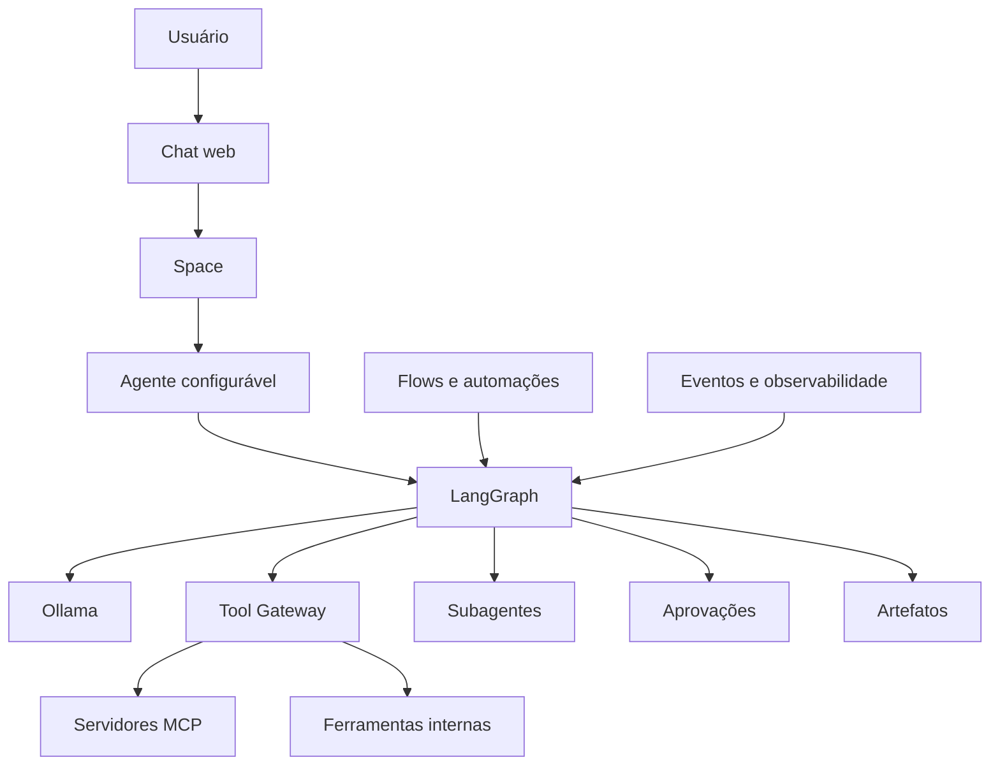

# Roadmap — AMP Agentic Workspace

## Visão

Transformar o notebook Ubuntu em um workspace agêntico pessoal e self-hosted, inspirado nos conceitos do Amazon Quick, mantendo:

- Ollama como servidor local de modelos e embeddings;
- LangGraph como runtime de agentes e workflows;
- FastAPI como API e plano de controle;
- PostgreSQL como fonte de verdade;
- Docker Compose como base operacional.

O destino não é apenas um chat multiagente. A AMP deve reunir chat, agentes configuráveis, Spaces, conhecimento, MCP, aprovações, Research, artefatos e automações.

## Estado atual

As fases 0–8 estão concluídas. Já existem Ubuntu, Docker, Ollama, roteamento FAST/SMART, LangGraph, FastAPI, SearXNG, PostgreSQL, conversas, mensagens, checkpoints, fila persistente, worker, retries, leases, idempotência e canal inicial de voz.

## Arquitetura-alvo

## Horizontes

### AMP Chat - MVP

- Fase 9 — Runtime observável e controlável ([#10](https://github.com/caleo-hub/amp-open-source/issues/10))
- Fase 10 — AMP Chat web com streaming ([#13](https://github.com/caleo-hub/amp-open-source/issues/13))

Resultado: conversar, acompanhar, diagnosticar e cancelar execuções pelo navegador.

### AMP Workspace - V1

- Fase 11 — Agentes configuráveis e versionados ([#18](https://github.com/caleo-hub/amp-open-source/issues/18))
- Fase 12 — Spaces e contexto de trabalho ([#19](https://github.com/caleo-hub/amp-open-source/issues/19))
- Fase 13 — Tool Gateway e integração MCP ([#20](https://github.com/caleo-hub/amp-open-source/issues/20))
- Fase 14 — Identidade, segurança e aprovações ([#12](https://github.com/caleo-hub/amp-open-source/issues/12))
- Fase 15 — Conhecimento, arquivos e memória ([#21](https://github.com/caleo-hub/amp-open-source/issues/21))

Resultado: workspace local com agentes, contexto, conectores e governança.

### AMP Agentic - V2

- Fase 16 — Multiagentes com propósito ([#11](https://github.com/caleo-hub/amp-open-source/issues/11))
- Fase 17 — AMP Research com fontes verificáveis ([#22](https://github.com/caleo-hub/amp-open-source/issues/22))
- Fase 19 — Artefatos e Apps ([#24](https://github.com/caleo-hub/amp-open-source/issues/24))

Resultado: delegação rastreável, pesquisa profunda e resultados persistentes.

### AMP Automate - V3

- Fase 18 — Flows, agenda e automações ([#23](https://github.com/caleo-hub/amp-open-source/issues/23))
- Fase 20 — Operação doméstica confiável ([#14](https://github.com/caleo-hub/amp-open-source/issues/14))

Resultado: workflows reutilizáveis, gatilhos, agenda e operação recuperável.

## Trilha paralela

Voz, Alexa e IoT continuam na [issue #15](https://github.com/caleo-hub/amp-open-source/issues/15), integrando-se progressivamente ao mesmo runtime, segurança e observabilidade.

## Princípios de execução

1. Um agente controlável antes de vários agentes.
2. UI e observabilidade antes de multiagentes.
3. Toda ferramenta passa pelo Tool Gateway.
4. Ações sensíveis exigem política e aprovação.
5. Agentes compartilham modelos Ollama quando possível para respeitar o hardware.
6. Toda fase termina com critério de pronto verificável.
7. Novas tecnologias entram somente quando resolvem uma necessidade demonstrada.

## Próximo passo

Executar a Fase 9 e, em seguida, a Fase 10. Juntas, elas formam o primeiro produto utilizável: **AMP Chat - MVP**.

A execução é acompanhada no [Project 6 — AMP Agentic Workspace Roadmap](https://github.com/users/caleo-hub/projects/6/views/1).
